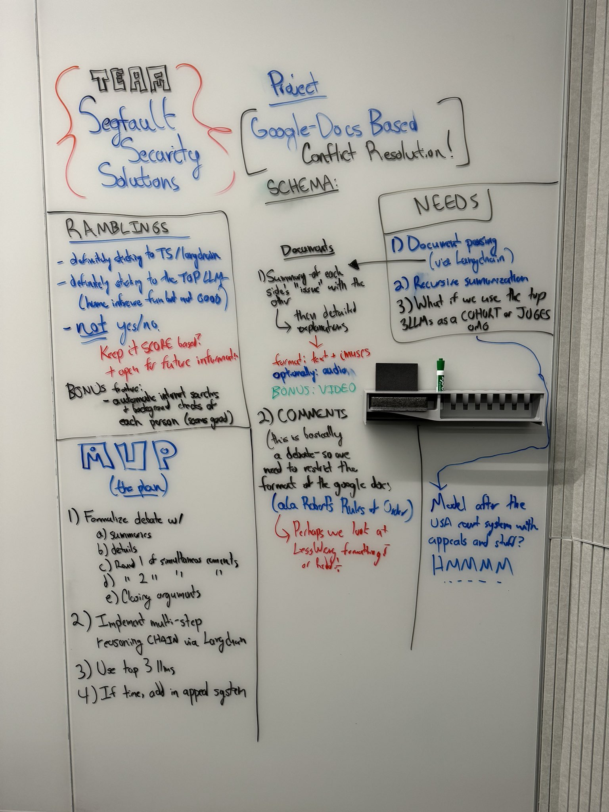

# Stanford AIxLaw Hackathon
# Stanford AI x Law Hackathon (9/8/2024, Stanford Campus)
- Team Name: Segfault Security Solutions
- Team Members: Caleb Ditchfield (github: kryptoklob)
- Repository: Stanford-AIxLaw-Hackathon_Google-Docs-Dispute-Resolution
- Whiteboarding Start Time: 5:51pm PST (end: 6:16pm PST)
- Code Start Time: 6:24pm PST
- Code Deadline: 7:00pm PST

# Project: Google Docs Automated Dispute Resolution



[https://docs.google.com/document/d/17lCyWnT9TnhfsiEuNxbsEIYWEhc57eboPlnFx3xerIk/edit?usp=sharing](Example Google Doc)

## Built With:

- [Langchain](https://github.com/langchain-ai/langchainjs)
- NodeJS
- Typescript
- Google Docs Integrations (tbd)

---

Everything below this line is the *original* forked readme - probably no time to update it given that I only have 12 minutes left.

---

# install

## Prerequisites

This assumes you're on a Unix system. (WSL is fine)

If on Windows...why?

First, make sure you are using Node v18. I recommend using [nvm](https://github.com/nvm-sh/nvm) for Node & npm version management.

```
nvm use 18
```

## Install Packages

```
cd spearbot-node && npm install
```

## Export OpenAI API Key

[Create an API key here if you don't have one.](https://platform.openai.com/account/api-keys)

You *must* have access to the GPT-4 model to use this tool.

(If you don't know if you have it, you probably don't.)

```
export OPENAI_API_KEY=<your-api-key-here>
```

1) Put the files to be audited (supports markdown and solidity) in `./spearbot-node/put_files_to_audit_here`.

    > Note: Data ingestion via codebase url (ie github codearena link for the contest) will be coming soon.

2) Run the summarizer. This will generate summaries of all markdown & solidity files, and output by default to `summarization-results.json`

    ```
    ./summarize.sh --dir spearbot-node/put_files_to_audit_here
    ```

    > Note: coming shortly will be a tool that will automatically generate markdown documentation of the entire codebase using the output from this step.

3) Run the embedder. This will create a vector database of the summarized code & the code itself. Outputs by default to `spearbot-node/vectore/embeddings/`

    ```
    ./embedder.sh --in summarization-results.json
    ```

4) Query the code via the analyzer chatbot.

    ```
    ./analyzer.sh "What does <somefunction> in <somecontract> do?"

    <natural language results>
    ```

